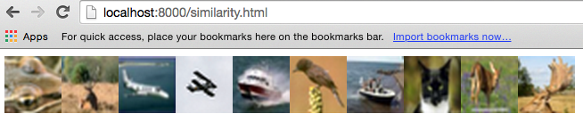
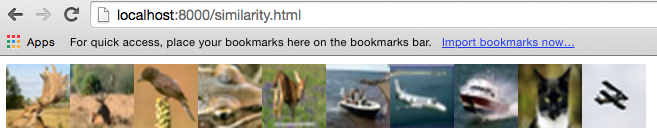
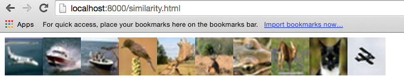

ImageSimilarity
===============

This demo uses the `image_features` API to sort images based on similarity.

## Getting Started with the Sample Data

Clone the repo:

`git clone https://github.com/IndicoDataSolutions/ImageSimilarity.git`

Fire up your test server using SimpleHTTPServer (or equivalent):

`python -m SimpleHTTPServer`

See the demo at `localhost:8000/similarity.html`!

Click on any image to trigger sorting based on similarity to that image.

The initial view (limited in this readme to 10 items) will look something like this:



Clicking on one of the more brownish images triggers a resort, which looks something like so, with the target item first:



Similar for the clicking one of the bluer items:



## How it Works

Take a look at `process.py`, the file where the magic happens. It's pretty short. 

```
from scipy.misc import imsave, imread
from indicoio import image_features
import json

# Compute image features for all images and save to json.
features = []
for i in range(250):						# there are 250 items in the default dataset
	img = imread('imgs/%s.png'%i)
	features.append(image_features(img))	# magic happens here!

json.dump(features, open('features.json', 'wb'))
```

The application sends the images in the `img` file to the Indico [image_features](http://indicoiopython.s3-website-us-west-2.amazonaws.com/indicoio.images.html?highlight=image_features#indicoio.images.features.image_features) API, which returns a JSON of abstract features describing the image. 

`similarity.js` orders these features by [Euclidean distance](http://en.wikipedia.org/wiki/Euclidean_distance) from a target image (the one you click on in the UI), and the nifty [Isotope](http://isotope.metafizzy.co/) library displays and animates the sorting process. 

## Further Reading

* [Using Indico to extract image features](http://indicoiopython.s3-website-us-west-2.amazonaws.com/indicoio.images.html?highlight=image_features#indicoio.images.features.image_features)
* [Using Indico to extract image features](http://indico.readme.io/v1.0/docs/image-features)
* [Getting Started with Indico APIs](http://www.slideshare.net/indicods/getting-started-with-indico-apis-python)
* [Learn more about Indico](http://www.indico.io/)
* [Filter and sort using Isotope](http://isotope.metafizzy.co/)
